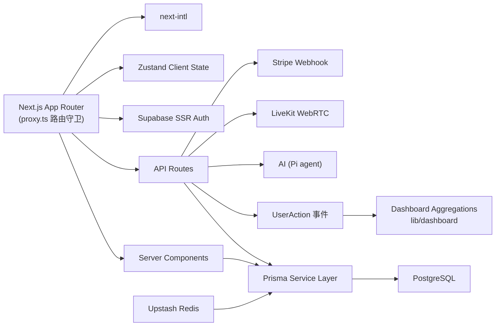

# 个开心 · Gekaixing

[](https://nextjs.org/)
[](https://www.typescriptlang.org/)
[](https://www.prisma.io/)
[](https://supabase.com/)
[](https://tailwindcss.com/)
[](./LICENSE)

**个开心（Gekaixing）** is a Twitter/X-style social platform — posts, replies, likes, bookmarks, shares, follow graph, DMs, AI chat, **live streaming**, job board, ads & premium monetization, and a full analytics dashboard. Bilingual (English / 简体中文). Deployed on Vercel.

**个开心** 是一个 Twitter/X 风格的社交平台 —— 发帖、回复、点赞、收藏、转发、关注关系、私信、AI 对话、**直播**、招聘、广告与会员变现，以及完整的数据分析看板。支持中英双语，部署在 Vercel。

> 线上产品 Live：<https://gekaixing.vercel.app>

## Table of Contents / 目录

- [Overview / 项目概览](#overview--项目概览)
- [Features / 功能特性](#features--功能特性)
- [Tech Stack / 技术栈](#tech-stack--技术栈)
- [Architecture / 架构](#architecture--架构)
- [Project Structure / 目录结构](#project-structure--目录结构)
- [Screenshots / 页面截图](#screenshots--页面截图)
- [Quick Start / 快速开始](#quick-start--快速开始)
- [Deployment / 部署上线](#deployment--部署上线)
- [Environment Variables / 环境变量](#environment-variables--环境变量)
- [Scripts / 常用命令](#scripts--常用命令)
- [Analytics & Dashboard / 数据看板](#analytics--dashboard--数据看板)
- [Content / 内容模块](#content--内容模块)
- [Developing / 二次开发](#developing--二次开发)
- [FAQ & Troubleshooting / 常见问题与排障](#faq--troubleshooting--常见问题与排障)
- [Security / 安全](#security--安全)
- [License / 许可证](#license--许可证)

---

## Overview / 项目概览

A real, deployed social product built on **Next.js 16 App Router**, with the business logic and data layer kept framework-portable.

一个真实上线运营的社交产品，基于 **Next.js 16 App Router** 构建，业务逻辑与数据层保持可迁移。

- **Social core 社交核心**: posts, replies, likes, bookmarks, shares, follow graph, DMs — 发帖、回复、点赞、收藏、转发、关注关系、私信
- **AI 能力**: Pi agent 驱动的 AI 助手（对话 + 联网检索，多供应商）+ 内容生成/润色 — Pi agent–powered AI assistant (chat + web search, multi-provider) + content generate/polish
- **Live 直播**: LiveKit WebRTC live streaming — LiveKit WebRTC 实时直播
- **Monetization 商业化**: Stripe premium subscriptions & ad payments — Stripe 会员订阅与广告付费
- **Analytics 数据分析**: event-log-driven dashboard (UV/PV, DAU/WAU/MAU, cohort retention, funnels, segmentation) — 事件驱动的数据看板
- **i18n 国际化**: 中英双语（`next-intl`），无 locale 路径段
- **Guest browsing 游客模式**: 未登录可浏览公开内容；游客访问受保护页会被引导到 `/account` 登录

## Features / 功能特性

### 社交 Social
- 富文本发帖 / 编辑 / 删除 Rich-text post creation, edit, delete（TipTap 编辑器，图片/视频上传至 Supabase Storage）
- 回复串 Replies（`Post.parentId/rootId` 自关联，计数反规范化）
- 点赞 / 收藏 / 转发 Like / Bookmark / Share
- 关注关系与个人主页 Follow graph & profiles（粉丝数/关注数，封面、头像裁剪）
- 私信 Messaging（`Conversation`/`Message`，未读红点、未读轮询）
- 浏览历史 History、我的喜欢 Likes、收藏夹 Bookmarks
- 通知 Notifications（基于 `@userid` 提及实时派生，httpOnly cookie 记录已读游标）

### 直播 Live
- LiveKit WebRTC 直播推流/播放（HLS.js 回放）
- 关注主播开播红点 Live indicator（`hasFollowedLiveStreams` 轮询）

### AI
- **AI 对话**（`/gekaixing/gkx`）：基于 `@earendil-works/pi` 智能体（`lib/ai/pi.ts`），统一 tool calling + `webSearch`/`fetchUrl` 联网检索，SSE 流式输出，会话持久化（`pi-session` + Postgres）
- **内容生成/润色**（`/api/post/ai`）：`mode: generate | polish`
- **多供应商**：Google / OpenAI / Anthropic 及各自兼容端点，Key 由用户自带（`ai_provider` / `ai_api_key` / `ai_model` 存于 Supabase `user_metadata`，兼容旧版 `gemini_*` 字段）

### 内容与信息流 Content & Discovery
- 首页信息流 Home feed：engagement 打分 + 时间衰减 + 关注作者加权 + 行为偏好（`UserAction`）
- Upstash Redis 5 分钟缓存、失效与重算锁 Feed caching & invalidation
- 搜索 Search（帖子 + 用户）、探索 Explore、找人 Connect People、关注流 Following
- 招聘墙 Jobs（`JobPosting`）
- 新闻 News（NewsAPI + 今日头条热点聚合）
- 博客 Blog（markdown）与 Notion 页面渲染

### 商业化 Monetization
- 会员订阅 Premium（Stripe Checkout + Webhook 为订阅状态唯一事实来源）
- 广告位投放 Ads（Stripe 支付，`/gekaixing/ads` 管理 + 投放数据）

### 数据看板 Analytics
- 事件驱动：客户端统一埋点写入 `UserAction` 表（FEED_IMPRESSION、POST_CLICK、REPLY_CREATE、POST_LIKE、POST_SHARE、POST_BOOKMARK、FOLLOW、DWELL 等）
- UV/PV、DAU/WAU/MAU、D1/D7 cohort 留存、漏斗、流量来源、受众与内容分段
- 模块化看板：业务首页、vip-support 深度分析、ads 广告、hire-talent 招聘、radar-intelligence 雷达情报、billing 账单、settings 等

### 体验 Experience
- 中英双语 next-intl、深浅主题 next-themes
- 移动端响应式（底部 Tab 导航）+ 桌面三栏布局
- 游客模式：公开页免登录浏览，未登录访问受保护页会被重定向到 `/account` 登录

## Tech Stack / 技术栈

| 层 Layer | 选型 Choice |
| --- | --- |
| Framework | Next.js 16（App Router，Turbopack） |
| Language | TypeScript（strict） |
| Styling | Tailwind CSS v4 + shadcn/ui |
| Database | PostgreSQL + **Prisma 7**（`@prisma/adapter-pg`，所有表走 Prisma） |
| Auth / Storage | Supabase SSR（Auth + RLS + Storage `images` bucket） |
| Real-time | LiveKit Cloud（WebRTC 直播）+ 轮询 |
| Cache | Upstash Redis REST（信息流缓存，缺省降级） |
| AI | `@earendil-works/pi` agent（`pi-agent-core` / `pi-ai`），多供应商：Google / OpenAI / Anthropic |
| Payments | Stripe（订阅 / 一次性广告支付） |
| State | Zustand |
| Forms | React Hook Form + Zod |
| Editor | TipTap（minimal-tiptap 富文本） |
| i18n | next-intl |
| Charts / Table | Recharts + TanStack Table |
| Content | react-notion-x（Notion）+ markdown（博客） |

## Architecture / 架构



**数据层约定 Data rules:**

- **所有业务表走 Prisma**（`prisma/schema.prisma`，`generated/prisma` 生成客户端）——数据库可随时更换，不引入第二种 ORM/驱动。
- **Supabase 只管** Auth（SQL 触发器/钩子）、RLS 策略、Edge Functions、Storage 桶。
- 表结构变更走 `npx prisma generate`；WIP 阶段用 `npx prisma db push`（`migrate dev` 会因 drift 要求重置库）。
- 环境变量命名注意：`client.ts` 读 `NEXT_PUBLIC_SUPABASE_PUBLISHABLE_DEFAULT_KEY`，`server.ts`/`proxy.ts` 读 `NEXT_PUBLIC_SUPABASE_PUBLISHABLE_KEY`（同值，需同时设置）。

## Project Structure / 目录结构

```text
app/
  gekaixing/        # 主应用（feed、chat、live、gkx AI、search、jobs、ads、settings…）
  account/          # 账号/登录入口
  dashboard/        # 数据看板（home / vip-support / ads / hire-talent / billing …）
  auth/             # 认证回调（callback、confirm、update_password）
  api/              # API 路由（post、reply、like、follow、chat、live、news、stripe…）
  blog/  notion/    # 博客 markdown 与 Notion 页面
  premium/  tos/  privacy/  …  # 产品/合规页
components/
  ui/               # shadcn/ui 基础组件
  gekaixing/        # 业务组件（信息流、AI ChatUI、直播、登录、看板…）
lib/                # 服务层（feed、dashboard、ai、chat、live、stripe、prisma…）
store/              # Zustand stores
messages/           # next-intl 字典（en / zh-CN）
utils/              # Supabase 客户端、工具函数
prisma/             # schema 与迁移
generated/prisma/   # 生成的 Prisma 客户端
scripts/            # 一次性脚本（init-storage、Stripe 测试…）
proxy.ts            # Next 16 路由守卫（会话刷新 + 公开路径 allowlist）
```

## Screenshots / 页面截图

| Feed 信息流 | Dashboard 看板 | Profile 个人主页 |
| --- | --- | --- |
|  |  |  |

截图存放于 `docs/screenshots/`。Screenshots live in `docs/screenshots/`.

## Quick Start / 快速开始

```bash
# 1) 安装依赖 Install dependencies
npm install

# 2) 配置环境变量 Configure env（.env.example → .env.development.local）
cp .env.example .env.development.local
# 填入 DATABASE_URL / Supabase keys，见下方「环境变量」

# 3) 生成 Prisma client
npx prisma generate

# 4) 同步 schema 到数据库（开发环境）
npx prisma db push

# 5) 创建 Supabase Storage 的 images 桶
npm run init:storage

# 6) 启动开发服务器
npm run dev
```

打开 [http://localhost:3000](http://localhost:3000)。Prisma Studio：`npx prisma studio`。

## Deployment / 部署上线

1. **Vercel**：导入仓库，框架自动识别 Next.js。构建命令 `npm run build`。
2. **Supabase**：
   - 在 Dashboard → **Authentication → URL Configuration** 设置：
     - **Site URL** 指向生产域名（如 `https://gekaixing.vercel.app`）
     - **Redirect URLs** 加入 `https://gekaixing.vercel.app/**`（本地开发保留 `http://localhost:3000/**`）
   - Google OAuth 的 Authorized redirect URIs 需包含 `https://<project-ref>.supabase.co/auth/v1/callback`。
   - 执行 `npm run init:storage` 创建图片存储桶（或手动创建 `images` 桶）。
3. **环境变量**：将下方「环境变量」全部配置到 Vercel，生产用 `NEXT_PUBLIC_URL`/`NEXT_PUBLIC_APP_URL` 指向正式域名。

> 若登录后回跳到 `localhost`，几乎总是 Supabase 的 Site URL / Redirect URLs 未指向生产域名——先检查 Dashboard 配置。

## Environment Variables / 环境变量

以 `.env.example` 为准，核心变量如下：

| 变量 Variable | 必填 | 说明 |
| --- | --- | --- |
| `DATABASE_URL` | ✅ | Prisma 连接串（建议连接池 Pooler） |
| `DIRECT_URL` | ⭕ | `prisma migrate`/CLI 直连串 |
| `NEXT_PUBLIC_SUPABASE_URL` | ✅ | Supabase 项目 URL |
| `NEXT_PUBLIC_SUPABASE_PUBLISHABLE_KEY` | ✅ | server/proxy 使用 |
| `NEXT_PUBLIC_SUPABASE_PUBLISHABLE_DEFAULT_KEY` | ✅ | client 使用（同值） |
| `SUPABASE_SERVICE_ROLE_KEY` | ✅ | 服务端特权 Key，**勿加 `NEXT_PUBLIC_` 前缀** |
| `NEXT_PUBLIC_URL` / `NEXT_PUBLIC_APP_URL` | ⭕ | 站点 URL（分享链接、支付回调、sitemap） |
| `UPSTASH_REDIS_REST_URL` / `_TOKEN` | ⭕ | 信息流缓存（缺省自动降级为不缓存） |
| `NEXT_PUBLIC_LIVEKIT_URL` / `LIVEKIT_API_KEY` / `LIVEKIT_API_SECRET` | ⭕ | 直播 LiveKit Cloud |
| `STRIPE_SECRET_KEY` / `NEXT_PUBLIC_STRIPE_PUBLISHABLE_KEY` / `STRIPE_WEBHOOK_SECRET` | ⭕ | 会员订阅与广告支付 |
| `NOTION_TOKEN` / `NOTION_DATABASE_ID` | ⭕ | Notion 页面渲染 |

> AI 不需要环境变量：Key 由用户各自在「设置 → 账号」配置，存于 Supabase `user_metadata`（`ai_provider` / `ai_api_key` / `ai_model`），无 Key 时 AI 接口返回 503。

## Scripts / 常用命令

```bash
npm run dev            # 开发服务器（Turbopack）
npm run build          # 生产构建（含 typecheck + lint）
npm run start          # 生产服务器
npm run lint           # ESLint
npm run init:storage   # 创建 Supabase images 存储桶
npm run test           # Vitest 全量测试
npm run test:integration # 数据库集成测试（RUN_DB_TESTS=1）
npm run stripe:listen  # Stripe webhook 本地转发

npx tsc --noEmit                  # 仅类型检查
npx vitest run <path>             # 跑单个测试文件
npx prisma generate               # 重新生成客户端
npx prisma db push                # 同步 schema 到开发库
npx prisma migrate dev            # 创建/应用迁移
npx prisma studio                 # 数据库 GUI
```

## Analytics & Dashboard / 数据看板

- 所有指标由 **`UserAction` 表派生**：客户端/组件埋点（`FEED_IMPRESSION`、`POST_CLICK`、`REPLY_CREATE`、`POST_LIKE`、`POST_SHARE`、`POST_BOOKMARK`、`FOLLOW`、`DWELL`）写入 JSON `metadata`（`{ source, kind }`，属于契约字段）。
- 聚合逻辑在 `lib/dashboard/service.ts`（`React cache()` 包裹），类型在 `lib/dashboard/types.ts`，缺数据时返回全零默认。
- 看板模块：`/dashboard`（业务总览）、`/dashboard/vip-support`（深度分析）、`/dashboard/ads`、`/dashboard/hire-talent`、`/dashboard/radar-intelligence`、`/dashboard/billing` 等。
- 新增指标流程：埋点 → 在 `lib/dashboard/service.ts` 扩展聚合 → 加类型 → 看板渲染。

## Content / 内容模块

- `/blog/[slug]`：个人博客（`markdown/` 下的 markdown 渲染）
- `/notion/[slug]`：Notion 页面（`lib/notion.ts` + react-notion-x）
- SEO：`app/sitemap.ts` + 各页 metadata / openGraph
- 新闻：`/api/news/*`（NewsAPI）+ 今日头条热点

## Developing / 二次开发

- **路由守卫**：`proxy.ts`（Next 16 middleware）负责会话刷新与公开路径 allowlist——新增公开页时记得把路径前缀加入 allowlist，否则游客会被重定向到 `/account`。
- **代码规范**：遵循 `AGENTS.md`（TypeScript strict、`@/` 别名、组件/服务分层）。
- **添加 API 路由测试**：参考 `app/api/post/ai/route.test.ts` 的 mock 模式（mock `@/utils/supabase/server` 与 `@/lib/ai/text`）。
- **提交前检查 Pre-commit**：
  - `npm run lint`
  - `npx tsc --noEmit`
  - `npm run test`

## FAQ & Troubleshooting / 常见问题与排障

| 现象 Symptom | 处理 Fix |
| --- | --- |
| 登录后跳回 `localhost` | Supabase → Auth → URL Configuration，Site URL 与 Redirect URLs 指向生产域名 |
| 类型错误 | `npx tsc --noEmit` |
| Prisma 客户端与 schema 不一致 | `npx prisma generate` |
| 开发环境 schema 不同步 | `npx prisma db push` |
| `migrate dev` 报 drift / 要求重置 | WIP 阶段改用 `db push`，或 `db execute` 直接应用变更 |
| AI 接口 503 | 用户未配置 AI Key（`ai_api_key`）→ 引导去 `/gekaixing/settings/account` |
| 看板数据不更新 | 确认事件确实写入 `user_action`，检查 `metadata` 的 `source`/`kind` |
| cohort 留存为 0 | 小样本或当天无活跃；周维度通常比日维度稳定 |
| 游客访问被重定向 | 确认路径已在 `proxy.ts` 的公开路径 allowlist |

## Security / 安全

- **严禁提交密钥**（`.env*.local`、`SUPABASE_SERVICE_ROLE_KEY`、`STRIPE_SECRET_KEY` 等）。
- 泄露的 Key 立即轮换；服务端特权 Key 不要加 `NEXT_PUBLIC_` 前缀。
- 报表、后台类路由确保鉴权与数据隔离；发现漏洞请先私下联系维护者。

## License / 许可证

MIT. See [LICENSE](./LICENSE).
