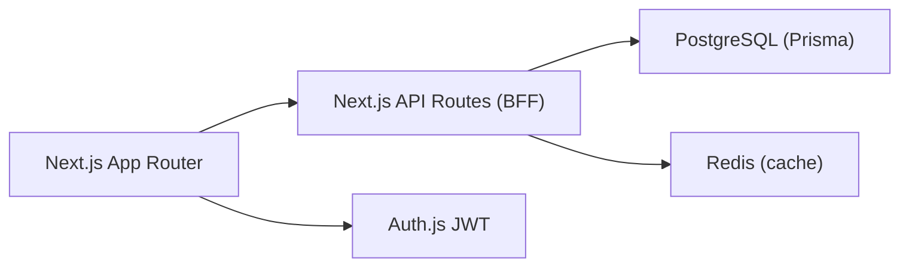

# Gekaixing / 个开心

[](https://nextjs.org/)
[](https://www.typescriptlang.org/)
[](./LICENSE)

A social platform built entirely with TypeScript — Next.js + Auth.js + Prisma.
基于 TypeScript 的全栈社交平台（Next.js + Auth.js + Prisma）。

中文部署手册：`docs/DEPLOY.zh-CN.md`

> 架构原则：**全程 TypeScript**，不引入其他语言 —— 这样任何部署者只需一套 Node 工具链，无需额外运行时。

## Overview / 项目概览

- Social features: posts, replies, likes, bookmarks, shares, follow graph, messaging
- Auth: Auth.js + JWT (`user.id` is the canonical identity)
- Data: PostgreSQL via Prisma
- Cache: Redis (Upstash, feed caching)
- AI hooks: GLM / OpenAI-compatible integration points

## Architecture / 架构



## Tech Stack / 技术栈

- Web: Next.js 16, TypeScript, Tailwind CSS v4, shadcn/ui
- Auth: Auth.js (JWT strategy)
- Data: Prisma + PostgreSQL
- Cache: Upstash Redis (REST)

## Repository Structure / 目录结构

```text
app/                    Next.js pages and API routes
components/             UI and feature components
lib/                    shared libs (auth, prisma, helpers)
prisma/                 Prisma schema and migrations
utils/                  compatibility and utility helpers
deploy/docker/          docker-compose (local postgres + redis)
```

## Quick Start (Local) / 本地快速开始

### 1) Install dependencies

```bash
npm install
```

### 2) Configure environment

```bash
cp .env.example .env.local
```

### 3) Start PostgreSQL and Redis

Use local services, or run via Docker compose:

```bash
cd deploy/docker && docker compose up -d postgres redis
```

### 4) Initialize database

```bash
npx prisma generate
npx prisma migrate dev
```

### 5) Run the app

```bash
npm run dev
```

Open [http://localhost:3000](http://localhost:3000).

## Environment Variables / 环境变量

See `.env.example` for the full template. Core variables:

Required:
- `DATABASE_URL` / `DIRECT_URL`
- `AUTH_SECRET`
- `NEXT_PUBLIC_URL`
- `NEXT_PUBLIC_APP_URL`

Optional integrations:
- `GOOGLE_CLIENT_ID` / `GOOGLE_CLIENT_SECRET` (OAuth login)
- `SMTP_*` (email verification)
- `STRIPE_*` (payments)
- `UPSTASH_REDIS_REST_URL` / `UPSTASH_REDIS_REST_TOKEN` (feed cache)
- `GLM_API_KEY` (AI)
- `NEXT_PUBLIC_NEWs_key` (news)

## Scripts / 常用命令

```bash
npm run dev          # dev server
npm run build        # production build
npm run start        # production server
npm run lint         # ESLint
npx tsc --noEmit     # type-check
npm run test         # Vitest

# Prisma
npx prisma generate
npx prisma migrate dev
npx prisma db push
```

## Testing / 测试

Minimum checks before merge:

```bash
npx tsc --noEmit
npm run test
npm run build
```

## Auth Contract / 认证约定

- JWT uses `user.id` as `sub`.
- All protected APIs must resolve current session and authorize by `user.id`.
- Do not use email as primary business identity.

## Notes / 说明

- This branch has migrated away from Supabase auth/storage/query runtime paths.
- Local storage uploads are served from `/uploads/<bucket>/<path>`.

## License / 许可证

MIT. See [LICENSE](./LICENSE).
